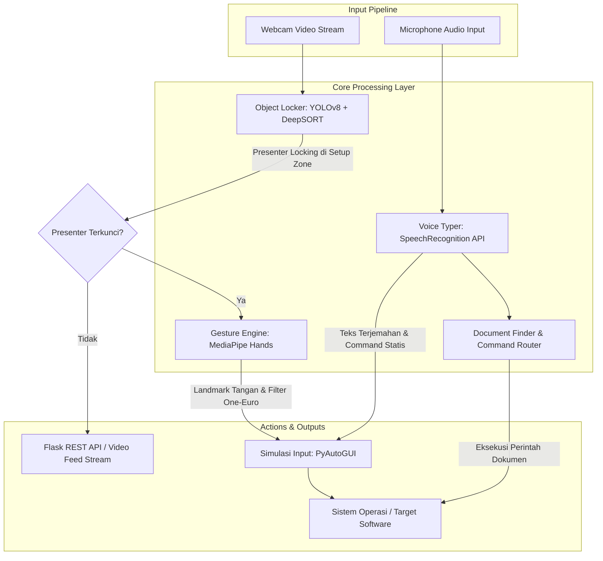
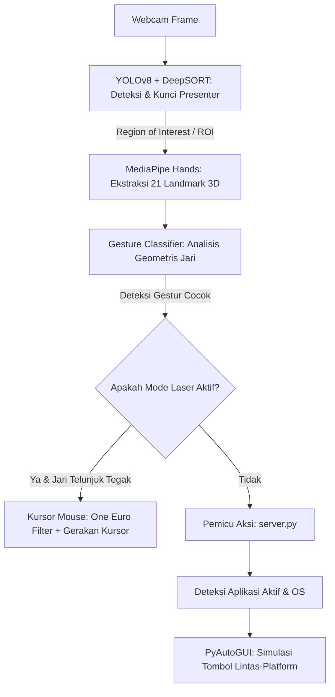

# El Presentasi (el_gestur_v2)
> **Sistem Presentasi Interaktif Berbasis Computer Vision (YOLOv8 & MediaPipe) dan Voice Recognition**

Sistem ini adalah solusi cerdas untuk mengontrol perangkat lunak presentasi (seperti Microsoft PowerPoint, Canva, Figma, dan Notion) serta pengetikan umum di semua aplikasi secara *hands-free* menggunakan gestur tangan dan perintah suara. Proyek ini menggabungkan pemrosesan gambar waktu nyata (real-time) berbasis kecerdasan buatan dengan pengenalan suara untuk meningkatkan interaktivitas presentasi dan produktivitas harian.

---

## 📸 Diagram Arsitektur & Alur Kerja Sistem

Sistem ini memiliki dua pipa input utama (kamera dan mikrofon) yang diproses secara konkuren untuk menghasilkan aksi interaksi pada sistem operasi target.



---

## 🚀 Fitur Utama

Sistem **El Presentasi (el_gestur_v2)** dirancang dengan fitur-fitur mutakhir berikut:

1. **Presenter Tracking & Locking (Anti-Distraksi)**
   * Menggunakan model **YOLOv8** untuk mendeteksi manusia dan **DeepSORT** untuk pelacakan identitas (*Presenter ID*).
   * Memiliki **Setup Zone** (area tengah 35% - 65% lebar layar). Jika presenter diam di zona ini selama 3 detik, sistem mengunci presenter tersebut.
   * Hanya mendeteksi gestur tangan dari presenter yang terkunci (*Region of Interest*). Gestur dari orang lain di latar belakang secara otomatis diabaikan.
   * Jika presenter keluar dari *frame* lebih dari 3 detik, kunci dilepas secara otomatis.

2. **Kontrol Gestur Tangan Real-Time**
   * Mengintegrasikan pelacakan *landmark* tangan MediaPipe untuk mengenali 9 gestur/pose yang berbeda.
   * Dilengkapi algoritme **One Euro Filter** untuk meredam jitter/getaran tangan pada pelacakan pointer laser.

3. **Smart Voice Typer (Speech-to-Text & Pemformatan Cerdas)**
   * Mengubah suara menjadi teks secara otomatis dalam Bahasa Indonesia menggunakan Google Speech API.
   * **Optimasi Background Listening**: Menggunakan penangkapan audio kontinu sehingga driver mikrofon tetap terbuka tanpa mengalami jeda atau *timeout* sambungan setiap 5 detik.
   * **Konversi Tanda Baca Lisan**: Mengonversi kata lisan bahasa Indonesia seperti *"titik"*, *"koma"*, *"baris baru"*, *"tanda tanya"*, dll. langsung menjadi simbol aslinya (`.`, `,`, `\n`, `?`, `!`, dll.).
   * **Smart Auto-Capitalization**: Mengkapitalisasi huruf pertama otomatis pada awal kalimat, setelah tanda baca akhir kalimat (`.`, `?`, `!`), atau setelah baris baru.
   * **Mute Suara (Mute/Unmute)**: Fitur pembisuan (mute) suara secara instan dari dashboard untuk mencegah pengetikan atau pemuatan perintah tidak disengaja akibat kebisingan latar belakang. Status audio disinkronkan secara real-time pada status lencana dashboard.

4. **Keandalan Pengetikan Lintas Aplikasi (Clipboard Sync)**
   * Sistem melakukan penyalinan teks dan menekan tombol tempel (`Cmd+V` / `Ctrl+V`) dengan jeda sinkronisasi `0.1` detik untuk mencegah hilangnya data atau pengetikan teks lama dari clipboard.
   * Penggunaan tombol modifier eksplisit (`keyDown` -> `press` -> `keyUp`) pada macOS memastikan kompatibilitas 100% dengan setelan aksesibilitas OS.

5. **Profil Profil Baru: Semua Aplikasi (Global)**
   * Selain PPT, Canva, Figma, dan Notion, sistem kini dilengkapi profil **Semua Aplikasi (Global)**.
   * Dalam profil global, kata-kata yang diucapkan akan langsung diketik ke aplikasi mana pun yang sedang aktif (misalnya MS Word, Chrome, WhatsApp, TextEdit, dll.) tanpa terganggu oleh pintasan khusus software presentasi.
   * Menyediakan gestur default global: `next` memicu tombol panah kanan (`right`), `prev` memicu panah kiri (`left`), dan `quit` memicu `esc`.

6. **Pencarian & Manajemen Dokumen Lokal**
   * Mesin pengindeks dokumen lokal yang memindai format berkas populer (`.docx`, `.xlsx`, `.pptx`, `.pdf`, `.txt`, `.csv`) pada direktori komputer (seperti *Documents*, *Desktop*, *Downloads*).
   * Mendukung pencarian dan pembukaan berkas dokumen langsung melalui perintah suara.

7. **Pemilihan Mikrofon Backend & Fleksibilitas Input**
   * Menyediakan pilihan sumber input suara antara browser lokal (Web Speech API) atau backend server (Python PyAudio).
   * Memungkinkan pemilihan mikrofon backend secara spesifik dari dropdown GUI dengan fitur restart otomatis yang instan jika perangkat input diganti saat perekaman aktif.

8. **Direct App Launcher (PowerPoint, Canva, Figma, Notion)**
   * Meluncurkan aplikasi target presentasi secara instan langsung dari panel dashboard web.
   * Deteksi cerdas: Memprioritaskan pembukaan aplikasi desktop native jika terinstal di komputer server, dengan fallback otomatis membuka versi web di default browser jika aplikasi desktop tidak terpasang.

9. **Akselerasi GPU Lintas-Platform Otomatis**
   * Deteksi hardware otomatis menggunakan PyTorch di backend: Menggunakan **MPS (Metal Performance Shaders)** pada macOS Apple Silicon, **CUDA** pada Windows/Linux dengan GPU NVIDIA, dan **CPU** sebagai fallback. Mengurangi beban CPU secara drastis saat memproses deteksi objek YOLOv8.

10. **Integrasi AppleScript untuk PowerPoint macOS (Akurasi Tinggi & Anti-Fokus)**
    * Memecahkan masalah keterbatasan aksesibilitas pada macOS di mana tombol `delete` atau `backspace` diblokir oleh PowerPoint jika kursor sedang aktif di area editor teks atau slide utama.
    * Menggunakan jembatan skrip (scripting bridge) **AppleScript** yang secara langsung berinteraksi dengan API internal Microsoft PowerPoint untuk menghapus slide aktif saat itu secara instan, tanpa terpengaruh oleh fokus kursor atau jendela penulisan.

11. **Gestur Baru L-Pose (Pistol) & Thumbs Down (Undo)**
    * Mengganti gestur 3 jari lama (yang memiliki kelemahan deteksi geometris jempol menekuk) menjadi **L-Pose (Gestur Pistol)** untuk menghapus slide secara responsif.
    * Menambahkan gestur **Thumbs Down (Jempol ke Bawah)** untuk melakukan pembatalan aksi (Undo) di seluruh aplikasi presentasi.

---

## 🗂️ Struktur Modul dan Kode Sumber

Sistem dirancang secara modular dengan pemisahan tugas yang jelas:

* **[server.py](file:///Users/fatirgibran/Kuliah/el_gestur_v2/server.py)**: Server backend Flask yang melayani rute API REST, menginisialisasi modul, menjalankan pipeline kamera utama, dan memicu pintasan keyboard untuk aplikasi aktif.
* **[gestur_engine.py](file:///Users/fatirgibran/Kuliah/el_gestur_v2/core/gestur_engine.py)**: Logika pendeteksian landmark tangan MediaPipe, klasifikasi gestur tangan, filter *One Euro* untuk pointer kursor, dan perhitungan swipe.
* **[object_lock.py](file:///Users/fatirgibran/Kuliah/el_gestur_v2/core/object_lock.py)**: Integrasi deteksi objek YOLOv8 dengan pelacak DeepSORT untuk mengunci target presenter utama dari gangguan latar belakang.
* **[voice_typer.py](file:///Users/fatirgibran/Kuliah/el_gestur_v2/core/voice_typer.py)**: Modul speech-to-text lisan Bahasa Indonesia yang menangani input mikrofon eksternal secara dinamis, beserta fitur auto-kapitalisasi, pengetikan clipboard terintegrasi, dan auto-punctuation cerdas.
* **[document_finder.py](file:///Users/fatirgibran/Kuliah/el_gestur_v2/core/document_finder.py)**: Pindai dan indeks file dokumen lokal dengan cepat, dilengkapi pencarian fuzzy, pembatasan indeks file, caching berbasis TTL, dan filter folder pengecualian.
* **[document_commands.py](file:///Users/fatirgibran/Kuliah/el_gestur_v2/core/document_commands.py)**: Mengurai query pencarian dan pembukaan dokumen dari teks suara.
* **[document_api.py](file:///Users/fatirgibran/Kuliah/el_gestur_v2/core/document_api.py)**: Menyediakan blueprint REST API `/documents` Flask dengan batasan akses loopback host lokal yang aman.
* **[app_launcher.py](file:///Users/fatirgibran/Kuliah/el_gestur_v2/core/app_launcher.py)**: Utilitas peluncur PowerPoint, Canva, Figma, dan Notion lintas platform via aplikasi desktop native or browser web default.
* **[command_router.py](file:///Users/fatirgibran/Kuliah/el_gestur_v2/core/command_router.py)**: Mendistribusikan input transkripsi suara ke modul perintah yang tepat secara berurutan.
* **[config.py](file:///Users/fatirgibran/Kuliah/el_gestur_v2/core/config.py)**: Pengaturan global parameter sistem (indeks kamera, resolusi, FPS, batas jarak pose, cooldown, folder pemindaian berkas).
* **[frontend/index.html](file:///Users/fatirgibran/Kuliah/el_gestur_v2/frontend/index.html)**: Kerangka halaman HTML bersih untuk antarmuka pengguna (dashboard web presentasi).
* **[frontend/style.css](file:///Users/fatirgibran/Kuliah/el_gestur_v2/frontend/style.css)**: Kumpulan style desain bertema dark mode glassmorphism dan animasi GUI responsif.
* **[frontend/app.js](file:///Users/fatirgibran/Kuliah/el_gestur_v2/frontend/app.js)**: Logika frontend untuk Web Speech API, integrasi visual video stream, pemanggilan API backend, dan polling sinkronisasi status.

---

## 🖐️ Pemetaan Gestur Tangan & Perilaku per Aplikasi

Sistem ini mendeteksi gestur tangan dan menerjemahkannya secara dinamis menjadi pintasan keyboard (hotkey) tergantung pada **Profil Software** yang sedang dipilih di dashboard (PowerPoint, Canva, Figma, Notion, atau Semua Aplikasi/Global).

### 1. Tabel Pemetaan Gestur & Perilaku Aplikasi

| Gestur / Pose Tangan | Deskripsi Pose Jari | PPT (`ppt`) | Canva | Figma | Notion | Semua Aplikasi (Global) |
| :--- | :--- | :--- | :--- | :--- | :--- | :--- |
| **Swipe Kiri** | Tangan terbuka melambai ke kiri | Slide Berikutnya (`Right`) | Slide Berikutnya (`Right`) | Slide Berikutnya (`Right`) | Halaman Bawah (`PageDown`) | Tombol Panah Kanan (`Right`) |
| **Swipe Kanan** | Tangan terbuka melambai ke kanan | Slide Sebelumnya (`Left`) | Slide Sebelumnya (`Left`) | Slide Sebelumnya (`Left`) | Halaman Atas (`PageUp`) | Tombol Panah Kiri (`Left`) |
| **Peace Pose** | Telunjuk & tengah tegak, lainnya mengepal | Mulai Presentasi (`F5` / `Cmd+Shift+Ret`) | Mulai Presentasi (`Cmd/Ctrl+Alt+P`) | Mulai Presentasi (`Cmd/Ctrl+Alt+Enter`) | Toggle Sidebar UI (`Cmd/Ctrl+\`) | - |
| **Fist Pose / Prayer**| Semua jari mengepal rapat / kedua telapak rapat | Keluar Presentasi (`Esc`) | Keluar Presentasi (`Esc`) | Tutup Tab Presentasi (`Cmd/Ctrl+W`) | Toggle Sidebar UI (`Cmd/Ctrl+\`) | Keluar/Batal (`Esc`) |
| **Shaka Pose** | Ibu jari & kelingking tegak, lainnya mengepal | Toggle Laser Pointer | Toggle Laser Pointer | Toggle Laser Pointer | Toggle Dark Mode (`Cmd/Ctrl+Shift+L`) | - |
| **Index Pointing** | Hanya jari telunjuk tegak (saat Laser aktif) | Gerakkan Pointer Kursor | Gerakkan Pointer Kursor | Gerakkan Pointer Kursor | Gerakkan Pointer Kursor (jika mode laser aktif) | Gerakkan Pointer Kursor |
| **OK Pose** | Telunjuk bersentuhan dengan ibu jari, jari lain terbuka | Buat Slide Baru (`Ctrl+M` / `Cmd+Shift+N`) | Buat Halaman Baru (`Cmd/Ctrl+Enter`) | Duplikat Slide/Frame (`Cmd/Ctrl+D`) | Buat Halaman Baru (`Cmd/Ctrl+N`) | - |
| **L-Pose (Pistol)** | Ibu jari & telunjuk tegak, lainnya mengepal | Hapus Slide (`AppleScript` di Mac / `Delete` di Win) | Hapus Halaman (`Backspace`) | Hapus Slide/Frame (`Esc` $\rightarrow$ `Backspace`) | Hapus Halaman (`Backspace`) | - |
| **Thumbs Down** | Ibu jari tegak mengarah ke bawah, lainnya mengepal | Batalkan Aksi/Undo (`Cmd/Ctrl+Z`) | Batalkan Aksi/Undo (`Cmd/Ctrl+Z`) | Batalkan Aksi/Undo (`Cmd/Ctrl+Z`) | Batalkan Aksi/Undo (`Cmd/Ctrl+Z`) | Batalkan Aksi/Undo (`Cmd/Ctrl+Z`) |
| **ILY Pose** | Ibu jari, telunjuk, & kelingking tegak, lainnya mengepal | Buka App Switcher (`Alt/Cmd+Tab`) | Buka App Switcher (`Alt/Cmd+Tab`) | Buka App Switcher (`Alt/Cmd+Tab`) | Buka App Switcher (`Alt/Cmd+Tab`) | Buka App Switcher (`Alt/Cmd+Tab`) |
| **Circle Pose** | Dua tangan membentuk lingkaran | Buka/Luncurkan Aplikasi Terpilih | Buka/Luncurkan Aplikasi Terpilih | Buka/Luncurkan Aplikasi Terpilih | Buka/Luncurkan Aplikasi Terpilih | - |

*Catatan: Gestur **OK Pose** selain membuat slide/halaman baru juga otomatis menyalakan fitur **Voice Typer** agar presenter bisa langsung mendiktekan teks.*

---

## ⚙️ Mekanisme Penerapan Deteksi Gestur

Berikut adalah alur kerja dan mekanisme teknis penerapan deteksi gestur pada sistem:



### 1. Pelacakan Tangan Menggunakan MediaPipe
Frame video yang berisi area tangan presenter utama dikirim ke pustaka **MediaPipe Hands**. MediaPipe menghasilkan **21 titik koordinat (landmark) 3D** untuk masing-masing tangan (Tangan Kiri dan Tangan Kanan).

### 2. Klasifikasi Gestur Secara Geometris
Deteksi gestur didasarkan pada hubungan spasial antar landmark (dalam `gestur_engine.py`):
*   **Fist (Kepalan)**: Dihitung dengan mengukur jarak dari landmark pergelangan tangan (`WRIST` / titik 0) ke ujung-ujung jari (titik 8, 12, 16, 20). Jika jarak tersebut lebih pendek daripada jarak pergelangan tangan ke buku jari tengah (`PIP` / titik 6, 10, 14, 18), maka jari tersebut terdeteksi ditekuk. Jika semua jari ditekuk, pose diklasifikasikan sebagai *Fist*.
*   **Peace Pose**: Memastikan jari telunjuk (`INDEX_FINGER_TIP`) dan jari tengah (`MIDDLE_FINGER_TIP`) memiliki jarak terjauh dari pergelangan tangan dibandingkan jari manis dan kelingking yang ditekuk.
*   **L-Pose (Pistol)**: Menganalisis bahwa ibu jari (`THUMB_TIP` / titik 4) dan jari telunjuk (`INDEX_FINGER_TIP` / titik 8) berjarak jauh dari pergelangan tangan (terbuka tegak), sedangkan jari tengah, manis, dan kelingking berada dalam keadaan mengepal rapat (jarak ke pergelangan tangan lebih kecil dari parameter batas).
*   **Thumbs Down**: Mengevaluasi bahwa ibu jari terbuka lebar dari pergelangan tangan dan posisinya (`THUMB_TIP.y`) secara konsisten berada di bawah pangkal ibu jari (`THUMB_CMC.y` / titik 2), sementara keempat jari lainnya ditekuk/mengepal rapat.
*   **Swipe (Sapuan)**: Koordinat X dari landmark pangkal jari tengah (`MCP` / titik 9) dimasukkan ke dalam buffer antrean sebanyak 20 frame. Jika terjadi perpindahan koordinat horizontal secara cepat dalam rentang waktu singkat, sapuan tangan akan terdeteksi.

### 3. Reduksi Getaran dengan One Euro Filter
Saat mode kursor laser aktif, tangan manusia cenderung bergetar (jitter). Untuk mengatasinya, sistem menggunakan **One Euro Filter** (filter lolos rendah adaptif ganda eksponensial). Filter ini secara dinamis menyesuaikan frekuensi cutoff berdasarkan kecepatan gerakan tangan:
*   Saat tangan diam, filter memotong frekuensi tinggi untuk meredam jitter halus secara maksimal.
*   Saat tangan bergerak cepat, filter mengurangi peredaman untuk menghilangkan latensi (keterlambatan respons kursor).

### 4. Pemetaan Dinamis Lintas-Platform (PyAutoGUI)
Setelah aksi terklasifikasi, backend Flask merujuk pada profil aplikasi yang aktif:
*   Sistem memeriksa sistem operasi yang sedang berjalan (`sys.platform == "darwin"` untuk macOS vs Windows/Linux).
*   Sistem memetakan tombol modifier yang sesuai (`command` untuk macOS dan `ctrl` untuk Windows).
*   Pustaka **PyAutoGUI** dipanggil untuk mensimulasikan penekanan tombol secara aman (misalnya: `pyautogui.press('right')`).

---

## 🎙️ Daftar Perintah Suara (Voice Commands)

Saat **Voice Typer** aktif, mikrofon akan terus mendengarkan suara presenter.

### 1. Perintah Penyuntingan Teks Statis (Voice Keyboard Shortcuts)
Jika presenter mengucapkan kata kunci berikut, aksi keyboard berikut akan dipicu di semua profil:
* *"tekan enter"* / *"baris baru"* / *"enter"* $\rightarrow$ Menekan tombol `Enter`.
* *"hapus"* $\rightarrow$ Menekan `Ctrl/Option + Backspace` untuk menghapus satu kata terakhir.
* *"hapus semua"* $\rightarrow$ Menekan `Ctrl/Cmd + A` diikuti `Delete`.
* *"spasi"* $\rightarrow$ Menekan tombol `Spacebar`.
* *"tab"* $\rightarrow$ Menekan tombol `Tab`.
* *"titik"* / *"koma"* / *"tanda tanya"* / *"tanda seru"* $\rightarrow$ Mengetikkan tanda baca terkait secara langsung.

### 2. Perintah Integrasi Dokumen Dinamis
Sistem secara cerdas memproses kalimat instruksi dokumen dalam Bahasa Indonesia:
* **Pencarian**: *"Cari dokumen laporan keuangan"* atau *"Tolong carikan file presentasi"*
  * *Sistem akan menyaring file berdasarkan kecocokan string dan mengembalikan daftar hasil.*
* **Pembukaan**: *"Buka dokumen nomor satu"* atau *"Tolong buka berkas yang kedua"*
  * *Sistem secara otomatis membuka file urutan terkait pada aplikasi default.*

### 3. Perintah Khusus Aplikasi (Software-Specific Commands)
Sistem secara dinamis mendeteksi aplikasi aktif pada dashboard dan merespons perintah suara spesifik berikut (diabaikan jika menggunakan profil **Semua Aplikasi (Global)**):
* **PowerPoint (`ppt`)**:
  * *"aktifkan pena"* / *"pena"* $\rightarrow$ Mengaktifkan mode menggambar (`Cmd/Ctrl+P`).
  * *"aktifkan stabilo"* / *"stabilo"* $\rightarrow$ Mengaktifkan stabilo kuning (`Cmd/Ctrl+I`).
  * *"aktifkan pointer"* / *"panah"* / *"kursor"* $\rightarrow$ Mengembalikan pointer biasa (`Cmd/Ctrl+A`).
  * *"hapus coretan"* / *"bersihkan coretan"* / *"hapus semua"* $\rightarrow$ Menghapus coretan pena pada slide (`E`).
  * *"layar hitam"* $\rightarrow$ Menggelapkan layar presentasi (`B`).
  * *"layar putih"* $\rightarrow$ Memutihkan layar presentasi (`W`).
  * *"kembali normal"* / *"tampilkan slide"* $\rightarrow$ Mengembalikan layar dari hitam/putih ke slide show (`Space`).
* **Canva**:
  * *"tampilkan konfeti"* / *"konfeti"* $\rightarrow$ Efek visual konfeti (`C`).
  * *"tampilkan gelembung"* / *"gelembung"* $\rightarrow$ Efek visual gelembung sabun (`O`).
  * *"blur layar"* / *"samarkan layar"* $\rightarrow$ Memburamkan layar presentasi (`B`).
  * *"minta diam"* / *"hening"* / *"shh"* $\rightarrow$ Animasi visual hening (`Q`).
  * *"suara drum"* / *"drumroll"* $\rightarrow$ Efek audio drumroll (`D`).
  * *"buka tirai"* / *"tirai"* $\rightarrow$ Animasi buka tirai (`U`).
  * *"mic drop"* $\rightarrow$ Efek visual mic drop (`M`).
  * *"timer [1-9] menit"* $\rightarrow$ Menyalakan timer bawaan Canva sesuai durasi (`1` - `9`).
* **Figma**:
  * *"tampilkan komentar"* / *"komentar"* $\rightarrow$ Buka/tutup komentar desainer (`Shift+C`).
  * *"zoom fit"* / *"tampilkan semua"* $\rightarrow$ Zoom to fit kanvas (`Shift+1`).
  * *"zoom seleksi"* / *"fokus objek"* $\rightarrow$ Zoom ke objek terpilih (`Shift+2`).
  * *"toggle grid"* / *"grid"* $\rightarrow$ Menampilkan/menyembunyikan grid layout (`Ctrl+Shift+4`).
  * *"sembunyikan ui"* / *"tampilkan ui"* $\rightarrow$ Menyembunyikan sidebar panel (`Cmd/Ctrl+\`).
* **Notion**:
  * *"buat judul"* / *"judul"* $\rightarrow$ Membuat block heading H1 (`/h1` + `Enter`).
  * *"buat daftar"* / *"daftar tugas"* $\rightarrow$ Membuat todo checkbox (`/todo` + `Enter`).
  * *"buat kutipan"* / *"kutipan"* $\rightarrow$ Membuat block quote (`/quote` + `Enter`).
  * *"buat poin"* / *"poin"* $\rightarrow$ Membuat bullet list (`/bullet` + `Enter`).
  * *"buat nomor"* / *"daftar nomor"* $\rightarrow$ Membuat numbered list (`/numbered` + `Enter`).
  * *"buat callout"* / *"callout"* $\rightarrow$ Membuat callout box (`/callout` + `Enter`).
  * *"buat tabel"* / *"tabel"* $\rightarrow$ Membuat table block (`/table` + `Enter`).
  * *"tutup sidebar"* / *"buka sidebar"* $\rightarrow$ Menyembunyikan/menampilkan panel samping (`Cmd/Ctrl+\`).

---

## ⚙️ Instalasi dan Konfigurasi

### 1. Prasyarat Sistem
* Python 3.9 - 3.11 (Disarankan Python 3.10 karena kompabilitas pustaka MediaPipe).
* Kamera Web (Built-in atau USB Webcam).
* Mikrofon yang aktif.
* Koneksi internet aktif (untuk Google Speech API).

### 2. Langkah Instalasi

1. **Clone Repositori**:
   ```bash
   git clone <url-repository>
   cd el_gestur_v2
   ```

2. **Buat Virtual Environment**:
   ```bash
   python -m venv venv
   source venv/bin/activate  # macOS/Linux
   # atau
   venv\Scripts\activate     # Windows
   ```

3. **Instal Dependensi**:
   Instal semua pustaka yang tertera dalam proyek:
   ```bash
   pip install flask flask-cors opencv-python mediapipe pyautogui ultralytics deep-sort-realtime speechrecognition pyperclip pyaudio sounddevice
   ```
   > [!NOTE]
   > Untuk instalasi `pyaudio` pada macOS, Anda mungkin perlu menginstal `portaudio` terlebih dahulu menggunakan Homebrew: `brew install portaudio && pip install pyaudio`.

4. **Unduh Model YOLOv8**:
   Unduh file model deteksi objek [yolov8n.pt](https://github.com/ultralytics/assets/releases/download/v8.2.0/yolov8n.pt) dan letakkan langsung di dalam folder root proyek `el_gestur_v2/` (sistem akan mengunduhnya secara otomatis pada saat pertama kali dijalankan jika koneksi internet tersedia).

---

## 🔌 Rute dan Endpoint API Backend

Server Flask berjalan secara default di `http://localhost:5005` dan menyediakan endpoint RESTful:

| Metode | Rute | Deskripsi Payload | Respons Sukses (JSON) |
| :--- | :--- | :--- | :--- |
| **POST** | `/set_software` | `{ "software": "ppt" \/ "canva" \/ "figma" \/ "notion" \/ "global" }` | `{"status": "success", "software": "global"}` |
| **POST** | `/toggle_laser` | Mengaktifkan/menonaktifkan mode laser pointer secara manual dari dashboard. | `{"status": "success", "laser_active": true}` |
| **POST** | `/start` | Mengaktifkan modul pelacakan presenter. | `{"status": "success"}` |
| **POST** | `/stop` | Mematikan modul pelacakan presenter dan melepas kunci. | `{"status": "success"}` |
| **POST** | `/lock` | Memaksa sistem untuk langsung mengunci presenter di depan kamera. | `{"message": "Sinyal kunci dikirim"}` |
| **POST** | `/unlock` | Melepas presenter yang sedang dikunci. | `{"message": "Presenter dilepas."}` |
| **POST** | `/voice_start`| Mengaktifkan rekaman suara Voice Typer. | `{"status": "success", "message": "Voice Typer dimulai."}` |
| **POST** | `/voice_stop` | Menonaktifkan rekaman suara Voice Typer. | `{"status": "success", "message": "Voice Typer dihentikan."}` |
| **GET** | `/voice_devices`| Mendapatkan daftar seluruh nama dan indeks mikrofon yang terdeteksi di server. | `{"status": "success", "devices": [{"index": 0, "name": "Mic"}]}` |
| **POST** | `/set_voice_device`| `{ "device_index": 2 \/ "default" }` - Mengatur mikrofon backend yang aktif. | `{"status": "success", "message": "Mikrofon berhasil diatur", ...}` |
| **POST** | `/open_ppt` | Membuka PowerPoint desktop native atau via fallback. | `{"status": "success", "message": "..."}` |
| **POST** | `/open_canva` | Membuka Canva desktop native atau via fallback web. | `{"status": "success", "message": "..."}` |
| **POST** | `/open_figma` | Membuka Figma desktop native atau via fallback web. | `{"status": "success", "message": "..."}` |
| **POST** | `/open_notion` | Membuka Notion desktop native atau via fallback web. | `{"status": "success", "message": "..."}` |
| **POST** | `/type` | `{ "text": "kata kata" }` - Mensimulasikan pengetikan teks ke jendela aktif. | `{"status": "success", "typed": "Kata kata"}` |
| **GET** | `/status` | Mengambil data status lengkap engine gestur, voice, & target software. | Status JSON lengkap dari backend. |
| **GET** | `/video_feed`| Akses stream video kamera yang telah dianotasi YOLO/MediaPipe. | Mjpeg Video Stream (untuk tag HTML ``). |

---

## 🚀 Cara Menjalankan Aplikasi

1. Aktifkan virtual environment Anda.
2. Jalankan berkas server utama:
   ```bash
   python server.py
   ```
3. Buka peramban (*web browser*) Anda ke halaman frontend:
   * Buka berkas `frontend/index.html` langsung di browser Anda. Halaman web ini menyediakan kontrol GUI untuk menyalakan/mematikan mesin gestur, memilih software target, mengontrol mikrofon, menampilkan daftar dokumen hasil pencarian, dan menampilkan *Live Video Stream* dari backend.

---

## 🧪 Pengujian Unit (Unit Testing)

Proyek ini dilengkapi dengan modul pengujian otomatis untuk memastikan logika klasifikasi pose dan routing perintah bekerja dengan baik tanpa mengandalkan hardware kamera.

Untuk menjalankan pengujian unit, jalankan perintah berikut dari direktori root:
```bash
PYTHONPATH=. venv/bin/python3 -m unittest discover -s tests
```

Berkas uji yang tercakup:
* `tests/test_command_router.py`: Menguji apakah perintah suara berhasil didistribusikan ke modul penangan dokumen yang tepat.
* `tests/test_document_finder.py`: Menguji indexing file dummy, pencarian fuzzy, pembatasan jumlah file, dan caching TTL.
* `tests/test_document_api.py`: Menguji keamanan akses URL IP loopback dan RESTful endpoint.
* `tests/test_gesture_engine_utility_poses.py`: Mensimulasikan landmark koordinat tangan palsu untuk menguji klasifikasi gestur *Circle* (buka PowerPoint), *Prayer* (Quit), *L-Pose* (Hapus), dan *Thumbs Down* (Undo).
* `tests/test_software_commands.py`: Menguji pendeteksian dan pemetaan perintah suara khusus aplikasi PowerPoint, Canva, Figma, Notion, dan **profil Global** dengan stubbing dependency dan mock PyAutoGUI secara aman.
* `tests/test_voice_typer.py`: Menguji alur pembersihan kata lisan menjadi tanda baca, kapitalisasi kalimat otomatis, pemblokiran pembisuan, dan pemrosesan transkripsi.

---

## 📝 Rekomendasi Format untuk Laporan Proyek Akademik

Jika Anda menggunakan repositori ini untuk menyusun dokumen **Laporan Proyek Akhir** atau **Tugas Kuliah**, berikut adalah saran pemetaan bab berdasarkan struktur repositori ini:

* **BAB I: PENDAHULUAN**
  * Latar Belakang: Masalah navigasi presentasi konvensional (ketergantungan klik fisik).
  * Tujuan: Membuat asisten presentasi nirkabel cerdas yang menggabungkan ekspresi tubuh (gestur) dan verbal (suara).
* **BAB II: LANDASAN TEORI**
  * Algoritme *Computer Vision* (YOLOv8 untuk deteksi presenter, MediaPipe Hands untuk estimasi pose tangan).
  * Pelacakan objek menggunakan algoritme DeepSORT (*Multiple Object Tracking*).
  * Teori pemulusan sinyal *One Euro Filter* untuk peredaman jitter pointer laser.
* **BAB III: ANALISIS DAN PERANCANGAN SISTEM**
  * Arsitektur Sistem: Mengacu pada diagram Mermaid di atas.
  * Uraian Modul: Detail peran `server.py` (termasuk kontrol AppleScript macOS untuk PowerPoint), `gestur_engine.py`, `object_lock.py`, dan `voice_typer.py`.
* **BAB IV: IMPLEMENTASI DAN PENGUJIAN**
  * Tunjukkan pemetaan gestur tangan (tabel gestur, termasuk modifikasi L-Pose dan Thumbs Down).
  * Pembahasan solusi masalah fokus (focus hierarchy) PowerPoint macOS menggunakan jembatan scripting AppleScript dibandingkan simulasi keyboard biasa.
  * Deskripsikan skenario pengujian unit menggunakan pustaka `unittest`.
  * Bahas efektivitas *Presenter Locking* YOLOv8 dalam mengabaikan distorsi latar belakang.
  * Ulas fungsionalitas pengetikan suara yang andal di seluruh aplikasi (profil global).
* **BAB V: PENUTUP**
  * Kesimpulan dan saran pengembangan (misalnya menambahkan model offline Speech-to-Text).
